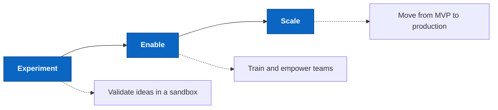

# Cloud2BR · Cloud to be Ready

**Consulting & Enablement hub for Microsoft cloud adoption**

----------

> **Mission:** Make the cloud _ready_, _accessible_, and _actionable_, helping teams move from concept to reality.

## How we work

## What you'll find here

| Category | Description |
|---|---|
| **Starter kits and templates** | Reusable code and reference architectures for proof-of-concepts |
| **Sandbox projects** | Experimental environments for testing and learning |
| **Tech talks and webinars** | Materials, demos, and examples from events |
| **Guides and documentation** | Practical resources for workshops and hands-on learning |
| **Utilities and tools** | Scripts and helpers to accelerate cloud adoption |

## Endorsements and certifications

<strong>Endorsed for Microsoft TechWorkshops</strong>

- <a href="https://partner.microsoft.com/id-id/marketing-center/assets/collection/migrate-and-modernize-your-estate#/" target="_blank" rel="noopener noreferrer">L200: Migrate and Modernize your Estate</a>
- <a href="https://microsoft.github.io/TWL200-Copilot-and-agents-at-work/" target="_blank" rel="noopener noreferrer">L200: Azure AI Apps and Agents</a>
- <a href="https://microsoft.github.io/TechWorkshop-L300-AI-Apps-and-agents/" target="_blank" rel="noopener noreferrer">L300: Azure AI Apps and Agents</a>
- <a href="https://github.com/microsoft/TechWorkshop-L300-GitHub-Copilot-and-platform" target="_blank" rel="noopener noreferrer">L300: GitHub Copilot and platform</a>

<strong>Microsoft certification study guides</strong>

- <a href="https://github.com/MicrosoftCloudEssentials-LearningHub/AI-900StudyGuide" target="_blank" rel="noopener noreferrer">AI-900: Azure AI Fundamentals</a>
- <a href="https://github.com/MicrosoftCloudEssentials-LearningHub/DP-900StudyGuide" target="_blank" rel="noopener noreferrer">DP-900: Azure Data Fundamentals</a>
- <a href="https://github.com/MicrosoftCloudEssentials-LearningHub/AI-102StudyGuide" target="_blank" rel="noopener noreferrer">AI-102: Azure AI Engineer Associate</a>
- <a href="https://github.com/MicrosoftCloudEssentials-LearningHub/DP-100StudyGuide" target="_blank" rel="noopener noreferrer">DP-100: Designing and Implementing a Data Science Solution on Azure</a>
- <a href="https://github.com/Cloud2BR-MSFTLearningHub/GH-900StudyGuide" target="_blank" rel="noopener noreferrer">GH-900: GitHub Foundations</a>

## Related organizations

| Organization | Purpose |
|---|---|
| <a href="https://github.com/Cloud2BR" target="_blank" rel="noopener noreferrer"><strong>Cloud2BR</strong></a> | Consulting and enablement hub |
| <a href="https://github.com/Cloud2BR-TEC" target="_blank" rel="noopener noreferrer"><strong>Cloud2BR TEC Hub</strong></a> | Technology Education Center |
| <a href="https://github.com/Cloud2BR-MSFTLearningHub" target="_blank" rel="noopener noreferrer"><strong>Cloud2BR MSFT Learning Hub</strong></a> | Open-source Microsoft Cloud Sandbox |

## Get involved

- **Explore** the org repositories for templates and learning resources
- **Try** the guides to run your own sandbox experiments
- **Join** events and webinars to deepen your cloud knowledge

> [!IMPORTANT]
> Content is provided **AS-IS** and **WITH ALL FAULTS**. Pricing shown is for demonstration only and does not reflect final pricing. Microsoft assumes no liability for your use of this information. For official guidance, refer to Microsoft's documentation or contact <a href="https://support.microsoft.com/contactus?ContactUsExperienceEntryPointAssetId=S.HP.SMC-HOME" target="_blank" rel="noopener noreferrer">Microsoft Sales and Support</a>.

> [!NOTE]
> Content is for **learning, demonstrations, and proof-of-concepts**. Review and validate before using in production.

<!-- START BADGE -->

  
  
Refresh Date: 2026-09-02

<!-- END BADGE -->
